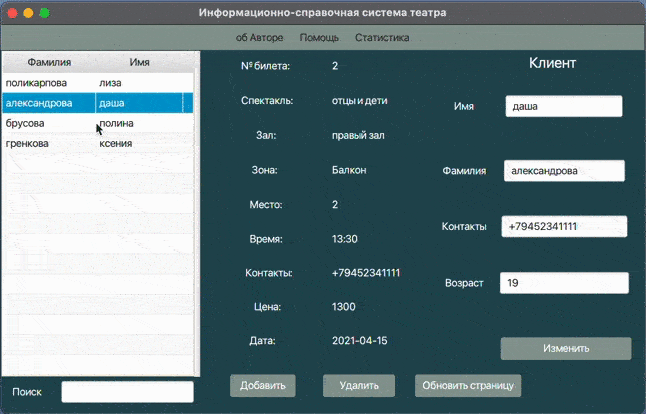

# client-server
## Информационно-справочная система театра 
Данное приложение реализованно с помощью Spring Boot, REST и JavaFX.
Информационно-справочная система театра позволяет получать информацию о клиенте и его билете,
удалять зрителей и билеты (неактулаьные),изменять данных о клиенте и создавтаь нового клиента со своим билетом на спектакль. 
Также, в данном приложении реализовано окно "Статистика", чтобы сотрудник мог определять популярность спектаклей и популярность зон в зале.

## 

